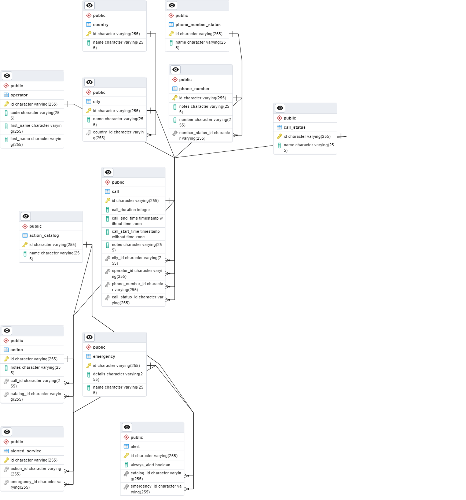

# Emergency Call Center

## Description

This is a emergency call center system that allows users to manage their emergencies and alerts. Simple CRUD operations
are performed on the emergencies and alerts.

## Getting Started

### Prerequisites

* Java 17
* Kotlin
* Maven
* Postgres SQL

### Installing

* Clone the repository
* Open the project in your favorite IDE
* Run `mvn clean install` to build the project
* Create a database named `EmergencyCallCenter` in Postgres

## Entity Classes

### Emergency

- id String
- serviceName String
- details String
- List<AlertedService> alertedServices (One to Many)
- List<Alert> alerts (One to Many)

### Alert

- id String
- alwaysAlert Boolean
- catalog ActionCatalog (Many to One)
- emergency Emergency (Many to One)

### ActionCatalog

- id String
- name String
- List<Alert> alerts (One to Many)
- List<Action> actions (One to Many)

### Action

- id String
- notes String
- catalog ActionCatalog (Many to One)
- call Call (Many to One)
- List<AlertedService> alertedServices (One to Many)

### AlertedService

- id String
- emergency EmergencyService (Many to One)
- action Action (Many to One)

### Call

- id String
- callStartTime Date
- callEndTime Date
- callDuration Integer
- notes String
- operator Operator (Many to One)
- phoneNumber PhoneNumber (Many to One)
- status CallStatus (Many to One)
- city City (Many to One)

### Operator

- id String
- code String
- firstName String
- lastName String
- List<Call> calls (One to Many)

### PhoneNumber

- id String
- number String
- notes String
- List<Call> calls (One to Many)
- status NumberStatus (Many to One)

### NumberStatus

- id String
- name String
- List<PhoneNumber> phoneNumbers (One to Many)

### CallStatus

- id String
- name String
- List<Call> calls (One to Many)

### City

- id String
- name String
- country Country (Many to One)
- List<Call> calls (One to Many)

### Country

- id String
- name String
- List<City> cities (One to Many)